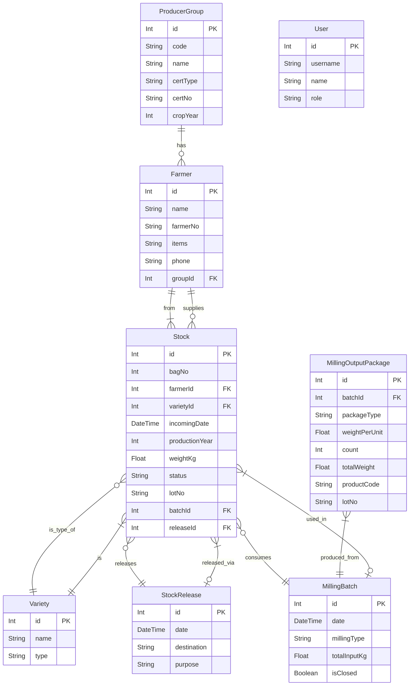

```mermaid
erDiagram
    ProducerGroup {
        Int id PK
        String code
        String name
        String certType
        String certNo
        Int cropYear
    }
    Farmer {
        Int id PK
        String name
        String farmerNo
        String items
        String phone
        Int groupId FK
    }
    Variety {
        Int id PK
        String name
        String type
    }
    Stock {
        Int id PK
        Int bagNo
        Int farmerId FK
        Int varietyId FK
        DateTime incomingDate
        Int productionYear
        Float weightKg
        String status
        String lotNo
        Int batchId FK
        Int releaseId FK
    }
    MillingBatch {
        Int id PK
        DateTime date
        String millingType
        Float totalInputKg
        Boolean isClosed
    }
    MillingOutputPackage {
        Int id PK
        Int batchId FK
        String packageType
        Float weightPerUnit
        Int count
        Float totalWeight
        String productCode
        String lotNo
    }
    StockRelease {
        Int id PK
        DateTime date
        String destination
        String purpose
    }
    User {
        Int id PK
        String username
        String name
        String role
    }

    ProducerGroup ||--o{ Farmer : "has"
    Farmer ||--o{ Stock : "supplies"
    Variety ||--o{ Stock : "is_type_of"
    Stock }|--|| Farmer : "from"
    Stock }|--|| Variety : "is"
    MillingBatch ||--o{ Stock : "consumes"
    Stock }|--o| MillingBatch : "used_in"
    MillingOutputPackage }|--|| MillingBatch : "produced_from"
    StockRelease ||--o{ Stock : "releases"
    Stock }|--o| StockRelease : "released_via"
```
